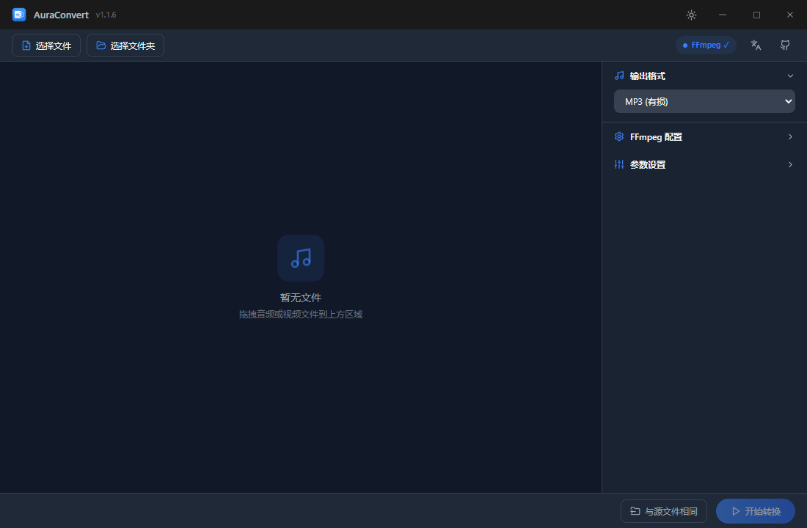
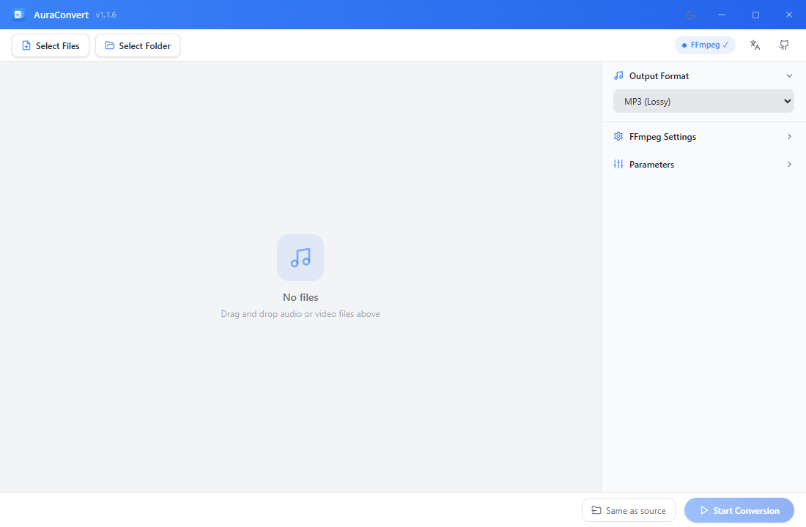

# AuraConvert - AudioForge

<p align="center">
  
</p>

<h1 align="center">AuraConvert</h1>

<p align="center">
  A lightweight, professional audio converter powered by Rust & Tauri<br>
  13 output formats · Batch conversion · Real-time progress · Video audio extraction
</p>

<p align="center">
  <a href="https://github.com/tabortao/AuraConvert/releases"></a>
  <a href="LICENSE"></a>
  
  <a href="docs/ChangeLog.md"></a>
</p>

<p align="center">
  <a href="README.zh-CN.md">中文</a>
</p>

## Overview

AuraConvert is a desktop audio converter built with Tauri v2, Rust, and React. It converts audio files between 13 formats, supports batch processing, and extracts audio from video files.

The app is designed around a few practical ideas:

- Audio conversion should be fast, reliable, and simple.
- Batch processing should be a first-class feature, not an afterthought.
- Users should have full control over output parameters (bitrate, sample rate, channels, volume, speed).
- The UI should be clean, dark, and distraction-free.

## Screenshots

<p align="center">
  
  
</p>

## Highlights

### Core Conversion

- **13 output formats**: MP3, AAC, FLAC, WAV, M4A, OGG, Opus, ALAC, AC3, AIFF, E-AC3, MP2, WavPack
- **Batch conversion**: Drag-and-drop multiple files or folders
- **Video audio extraction**: Extract audio from MP4, MKV, AVI, MOV, WMV, FLV, WebM
- **Album cover preservation**: Automatically retains cover art from source files

### Parameter Control

- **Bitrate**: Adjustable output bitrate for lossy formats
- **Sample Rate**: 44100 / 48000 / 96000 / 192000 Hz
- **Channels**: Mono / Stereo
- **Bit Depth**: 16 / 24 / 32 bit for lossless formats
- **Volume**: 10%–400% volume scaling
- **Speed**: 0.25x–4.00x playback speed transformation

### User Experience

- **Real-time progress**: Per-file progress + total progress + ETA
- **Compression ratio**: Displayed after conversion
- **Audio metadata**: View title, artist, album, cover art
- **Dark theme**: Spotify-style dark UI (`#0a0a0a` background, `#1db954` accent)
- **Multi-language**: Chinese / English
- **Keyboard shortcuts**: `Ctrl+Enter` to convert, `Delete` to clear list

### FFmpeg Integration

- **Auto-detection**: User config → System PATH → Windows Registry → Common install paths
- **Manual configuration**: Specify custom FFmpeg path
- **Version detection**: Auto-check FFmpeg version
- **Real-time progress**: Parse `-progress pipe:1` output for accurate progress

## Tech Stack

| Layer | Technology | Version |
|------|------|------|
| Desktop Framework | Tauri | v2 |
| Backend | Rust | 2024 Edition |
| Frontend | React | v19 |
| TypeScript | ~5.7 |
| Build Tool | Vite | v6 |
| CSS | Tailwind CSS | v4 |
| UI | Radix UI + shadcn/ui (New York) |
| State | Zustand | v5 |
| i18n | react-i18next | v15 |
| Audio Metadata | lofty | v0.21 |
| Async Runtime | tokio | v1 (full) |

## Getting Started

### Prerequisites

- Rust >= 1.70
- Node.js >= 18
- pnpm >= 8
- FFmpeg >= 5.0
- Windows: MSVC Build Tools (C++ desktop development)

### Development

```bash
git clone https://github.com/tabortao/AuraConvert.git
cd AuraConvert

pnpm install
pnpm tauri dev
```

The app will be available at `http://localhost:1420`.

### Build

```bash
pnpm tauri build
```

Output artifacts are in `src-tauri/target/release/bundle/`.

### Testing

```bash
cd src-tauri
cargo test
```

## Project Structure

```text
AuraConvert/
├── src/                          # React frontend
│   ├── components/               # UI components
│   ├── hooks/                    # Custom React hooks
│   ├── stores/                   # Zustand state management
│   ├── i18n/                     # Internationalization (zh/en)
│   ├── types/                    # TypeScript type definitions
│   └── utils/                    # Utility functions
├── src-tauri/                    # Rust backend
│   ├── src/
│   │   ├── commands/             # Tauri IPC commands
│   │   ├── converter/            # Conversion logic (format_config, args_builder, smart_optimize)
│   │   ├── ffmpeg/               # FFmpeg integration (detector, runner, parser)
│   │   ├── models/               # Data models
│   │   └── utils/                # Path utilities
│   ├── Cargo.toml
│   └── tauri.conf.json
├── docs/                         # Documentation
│   ├── ChangeLog.md
│   └── COMMON_ERRORS.md
├── package.json
├── vite.config.ts
└── tsconfig.json
```

## Tauri Commands

| Command | Parameters | Return | Description |
|---------|------------|--------|-------------|
| `detect_ffmpeg` | — | `FfmpegStatus` | Auto-detect FFmpeg path and version |
| `start_conversion` | `files, params` | `String` | Start batch conversion |
| `cancel_conversion` | — | `()` | Cancel current conversion |
| `read_audio_info` | `file_path: String` | `AudioInfo` | Read audio metadata |
| `select_files` | — | `Vec<String>` | Open file picker dialog |
| `select_output_dir` | — | `Option<String>` | Open directory picker dialog |
| `get_file_metadata` | `path: String` | `{size: u64}` | Get file size |

## Supported Formats

| Format | Type | Codec | Max Bitrate | Notes |
|--------|------|-------|-------------|-------|
| MP3 | Lossy | `libmp3lame` | 320kbps | |
| AAC | Lossy | `aac` | 512kbps | |
| M4A | Lossy | `aac` | 512kbps | needs `-f ipod` |
| OGG | Lossy | `libvorbis` | 500kbps | uses `-q:a` quality mode |
| Opus | Lossy | `opus` | 510kbps | needs `-strict -2` |
| AC3 | Lossy | `ac3` | 640kbps | |
| E-AC3 | Lossy | `eac3` | 1024kbps | |
| MP2 | Lossy | `mp2` | 384kbps | |
| FLAC | Lossless | `flac` | — | supports bit depth |
| WAV | Lossless | `pcm_s16le` | — | supports bit depth |
| ALAC | Lossless | `alac` | — | |
| AIFF | Lossless | `pcm_s16be` | — | |
| WavPack | Lossless | `wavpack` | — | |

## Design

- **Primary Color**: `#1db954` (Spotify Green)
- **Background**: `#0a0a0a` (Deep Black)
- **UI Style**: Spotify-style dark theme, shadcn/ui (New York)
- **Icons**: Lucide React

## Articles

> I spent half a year looking for a decent audio converter — in the end I just built one.

- 📖 [微信公众号 (WeChat Official Account)](https://mp.weixin.qq.com/s/S-9kICTv0paTZKba145YKA)
- 📖 [知乎 (Zhihu)](https://zhuanlan.zhihu.com/p/2049041956710491784)
- 📖 [吾爱破解 (52pojie)](https://www.52pojie.cn/thread-2112569-1-1.html)

## Documentation

| Document | Description |
|----------|-------------|
| [docs/ChangeLog.md](docs/ChangeLog.md) | Changelog |
| [docs/COMMON_ERRORS.md](docs/COMMON_ERRORS.md) | Common errors & lessons learned |

## License

MIT License

## Acknowledgments

- [Tauri](https://tauri.app/) — Cross-platform desktop framework
- [FFmpeg](https://ffmpeg.org/) — Multimedia processing
- [lofty](https://github.com/Serial-ATA/lofty) — Rust audio metadata library
- [React](https://react.dev/) — UI framework
- [Tailwind CSS](https://tailwindcss.com/) — Utility-first CSS framework